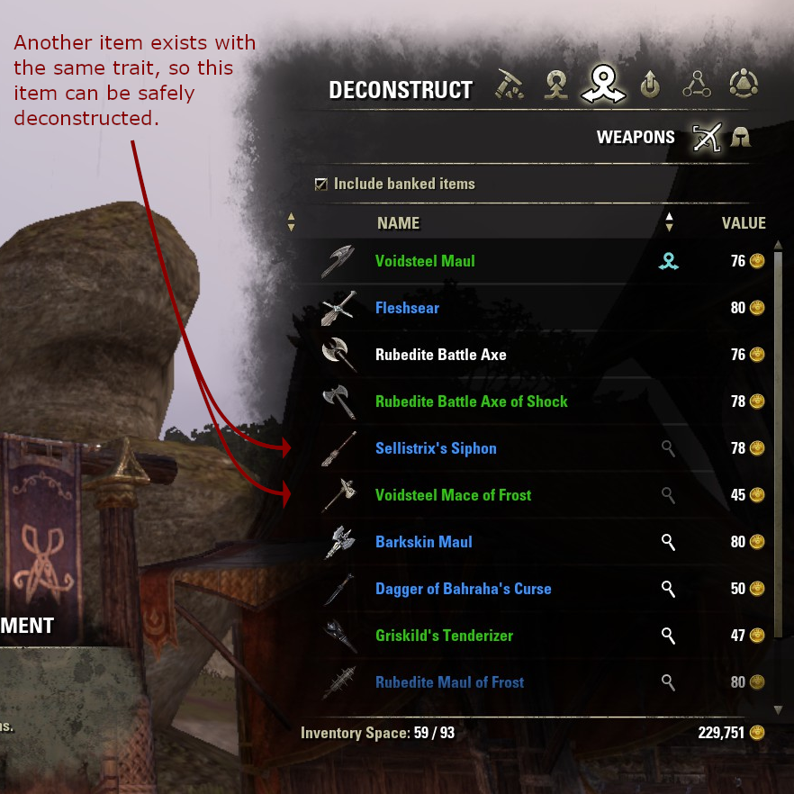

# NoResearchDupes

NoResearchDupes is an Elder Scrolls Online add-on to detect when you have
more than one item that can be researched to provide the same trait, and
mark all but one of them as a "duplicate" so that you can sell or
deconstruct them.

Researching a trait isn't affected by the quality of the item you use for
the research, but deconstructing the other items is. NoResearchDupes
priorities the higher quality items for deconstruction (i.e. marked as
"duplicate") and leaves the lowest quality item for research.

Duplicate items are shown in the UI by changing the colour of the magnifying
glass icon indicating that the item has a researchable trait to a dark grey
colour. Currently, this is only done in the blacksmithing/clothing/woodworking/
jewelry deconstruction view, but could easily be extended to other inventory
views.

## Installation

1. 	Head to the [release list][releases].

2. 	Download `NoResearchDupes-N.zip` for the latest release.

3. 	Open the downloaded file, and copy the `NoResearchDupes` folder contained
   	within.

4. 	Navigate to `Documents\Elder Scrolls Online\live\AddOns` and paste the
   	previously copied folder here.

5. 	If Elder Scrolls Online is currently running, open the chat bar and type
	`/reloadui` to load the addon. If not, the addon will be loaded the next
	time the game is launched.

## Support

Feel free to [open an issue on this repository][issues] or send an in-game mail
to `@always.ada` if you have any problems. I work on this in my free time, so
I don't provide any guarantees on when/if I will respond, but I try my best.

## License

[LICENSE.txt](LICENSE.txt)

[releases]: https://github.com/kierdavis/NoResearchDupes/releases
[issues]: https://github.com/kierdavis/NoResearchDupes/issues
